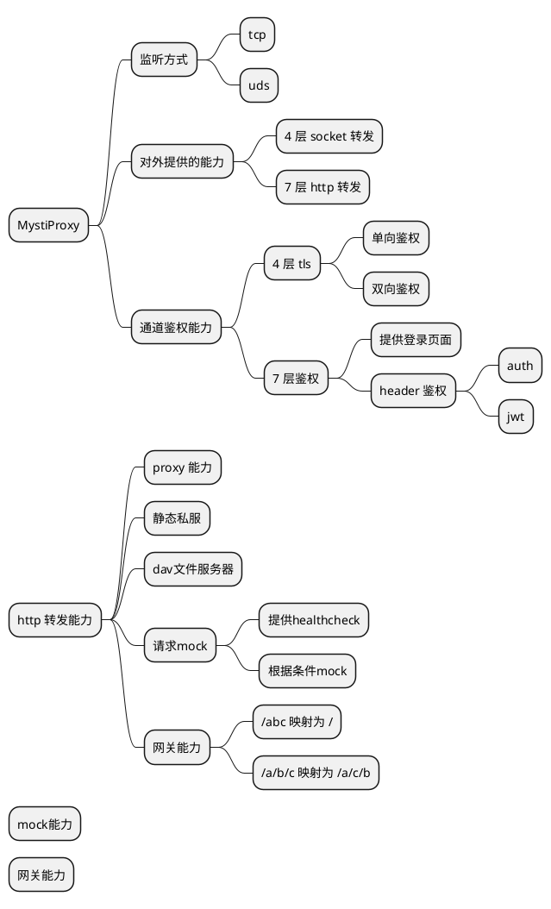
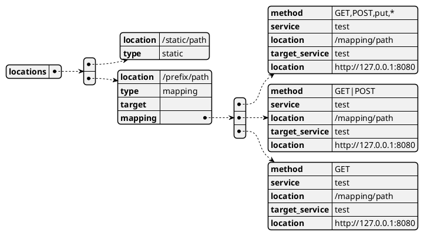
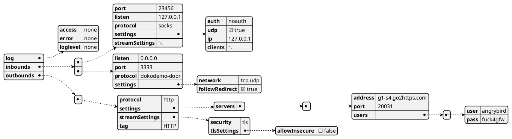

# 主要能力

```plantuml
   @startmindmap
   * MystiProxy
   ** 监听方式
   *** tcp
   *** uds
   ** 对外提供的能力
   *** 4 层 socket 转发
   *** 7 层 http 转发
   ** 通道鉴权能力
   *** 4 层 tls
   **** 单向鉴权
   **** 双向鉴权
   *** 7 层鉴权
   **** 提供登录页面
   **** header 鉴权
   ***** auth
   ***** jwt

   * http 转发能力
   ** proxy 能力
   ** 静态私服
   ** dav文件服务器
   ** 请求mock
   *** 提供healthcheck
   *** 根据条件mock
   ** 网关能力
   *** /abc 映射为 /
   *** /a/b/c 映射为 /a/c/b

   * mock能力

   * 网关能力
    @endmindmap
```

## mapping的能力
mapping主要能力如下：

```plantuml
@startyaml
locations:
  - location: /static/path
    type: static
  - location: /prefix/path
    type: mapping
    target: ""
    mapping:
      - method:  "GET,POST,put,*"
        service: test
        location: /mapping/path
        target_service: "test"
        location: "http://127.0.0.1:8080"
      - method:  GET|POST
        service: test
        location: /mapping/path
        target_service: "test"
        location: "http://127.0.0.1:8080"
      - method:  GET
        service: "test"
        location: /mapping/path
        target_service: "test"
        location: "http://127.0.0.1:8080"
@endyaml
```

```plantuml
@startjson
{
  "log": {
    "access": "none",
    "error": "none",
    "loglevel": "none"
  },
  "inbounds": [
    {
      "port": 23456,
      "listen": "127.0.0.1",
      "protocol": "socks",
      "settings": {
        "auth": "noauth",
        "udp": true,
        "ip": "127.0.0.1",
        "clients": null
      },
      "streamSettings": null
    },
    {
      "listen": "0.0.0.0",
      "port": 3333,
      "protocol": "dokodemo-door",
      "settings": {
        "network": "tcp,udp",
        "followRedirect": true
      }
    }
  ],
  "outbounds": [
    {
      "protocol": "http",
      "settings": {
        "servers": [
          {
            "address": "g1-s4.go2https.com",
            "port": 20031,
            "users": [
              {
                "user": "angrybird",
                "pass": "fuck4gfw"
              }
            ]
          }
        ]
      },
      "streamSettings": {
        "security": "tls",
        "tlsSettings": {
          "allowInsecure": false
        }
      },
      "tag": "HTTP"
    }
  ]
}
@endjosn
```