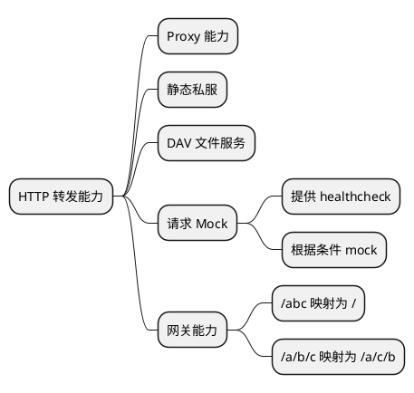

# 架构设计

本文档介绍 MystiProxy 的系统架构和核心功能设计。

## 系统概述

MystiProxy 是一个微服务模拟器，主要解决服务迁移过程中的调试、中间态验证等问题。它能够在 Kubernetes 中不使用镜像的情况下安装，主要使用 Secret/ConfigMap 进行配置管理。

## 核心特性

### 监听方式

- **TCP**: 标准 TCP 监听
- **UDS**: Unix Domain Socket 监听

### 对外提供的能力

#### 4 层 Socket 转发

- TCP 协议转发
- UDP 协议转发（可能存在丢包问题）
- UDS 协议转发

#### 7 层 HTTP 转发

- HTTP/HTTPS 转发
- 单向认证
- 双向认证
- 忽略认证

### 通道鉴权能力

#### 4 层 TLS

- 单向鉴权
- 双向鉴权

#### 7 层鉴权

- 提供登录页面
- Header 鉴权
  - Auth 鉴权
  - JWT 鉴权

## 功能架构

### HTTP 转发能力



### 核心功能

#### 1. 静态资源代理

将目录作为静态资源进行代理：

- URI 转换为具体的目录
- `/static/` 需要检索 `~/static/index.html` 或 `~/static/index.html` 并进行响应

#### 2. 请求 Mock

对请求进行 Mock 响应：

- 匹配请求后，直接响应内容
- 匹配到 URI，直接响应
- 根据条件匹配到响应
- 对需要 Mock 的响应进行特殊处理或加密处理

#### 3. Proxy 代理

代理请求到目标地址：

- 目标地址可以是 MystiProxy 监听的地址
- 目标地址也可以是其他服务监听的地址

## 请求处理流程

### URI 转换

HTTP 入口请求如何转换为目标的地址的请求：

1. **URI 的转换**
   - 不做处理
   - 直接转换
   - 匹配前缀后，修改前缀，或者删除前缀（前缀匹配一定以 '/' 结尾）
   - 参数化的匹配，将参数透穿
   - 前缀参数化，将前缀参数透传

2. **Header 的处理**
   - 增加 Header（达到某种条件后再删除，默认为没有才增加）
   - 强制替换 Header（达到某种条件后再替换，默认为直接替换）
   - 删除 Header（达到某种条件后再删除，默认为直接删除）

3. **Body 的处理**
   - 借用模版引擎，将 Body 的处理能力增强
   - 主要只针对 `Content-type: application/json` 类型的 Body 进行处理
   - 可以调用其他请求对 URI 中的一些内容进行特殊化处理

### 响应转换

目标地址的响应如何转化为被代理客户端想要的请求：

- 响应头转换
- 响应体转换
- JSON 转换（使用 JSONPath）

## 4 层协议转发

主要是打通通信端点之间的网络隔离，其中增加 IP 隔离的能力。

### 支持的协议

| 监听方式 | 目标类型 | TCP | UDP | UDS |
|----------|----------|-----|-----|-----|
| 监听 | ✓ | ✓ | ✓ | ✓ |
| TCP | ✓ | ✓ | ✓ | ✓ |
| UDP | ✓ | ✓ | ✓ | ✓ |
| UDS | ✓ | ✓ | ✓ | ✓ |

## 路由映射

### URI-Mapping 路由映射

路由映射主要提供 4 种模式：

1. **Full**: 全路径匹配
2. **Prefix**: 前缀匹配
3. **Regex**: 带参数的正则匹配
4. **PrefixRegex**: 带正则的前缀匹配

### 匹配规则示例

```text
当 baseUri = /时，in_uri = /a/b/c 时，返回 Some(Prefix)
当 baseUri = /a/b/c 时，in_uri = /a/b/c/d/e 时，返回 Some(Prefix)
当 baseUri = /a/b/c 时，in_uri = /a/b/c 时，返回 Some(Full)
当 baseUri = /a/{id}/c 时，in_uri = /a/b/c 时，返回 Some(Regex)，其中 {id} 是参数，匹配 inUri 中的 b
当 baseUri = /a/{id}/c 时，in_uri = /a/b/c/d/e 时，返回 Some(PrefixRegex)，其中 {id} 是参数，匹配 inUri 中的 b
当 baseUri = /a/{id}/c 时，in_uri = /a/b/d/e/f 时，返回 None
```

## 技术栈

- **语言**: Rust 1.75+ (Edition 2021)
- **异步运行时**: Tokio
- **HTTP 框架**: Hyper
- **配置格式**: YAML
- **序列化**: Serde

## 设计原则

### 1. 不使用镜像

在 Kubernetes 中安装时，不使用镜像，使用 scratch 基础镜像。

### 2. 使用 Secret/ConfigMap

主要使用 Kubernetes 的 Secret 和 ConfigMap 进行配置管理。

### 3. 不使用 SO 加载技术

使用 ZIP 多文件解压为一个文件的技术，而不是 SO 加载技术。

### 4. 限制

- ConfigMap 只能存储为 1M，且为字符串
- 不使用镜像，使用 scratch
- 支持下载方式

## 扩展性

### 插件系统

MystiProxy 支持插件扩展：

- 自定义请求处理器
- 自定义响应处理器
- 自定义鉴权模块
- 自定义日志模块

### 中间件

支持中间件链式处理：

- 请求预处理
- 响应后处理
- 错误处理
- 日志记录

## 下一步

- 查看 [开发计划](./DEVELOPMENT.md) 了解开发进度
- 查看 [配置说明](./CONFIGURATION.md) 了解详细配置
- 查看 [使用示例](./EXAMPLES.md) 了解具体应用场景
