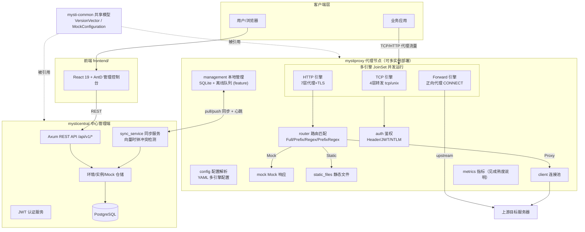
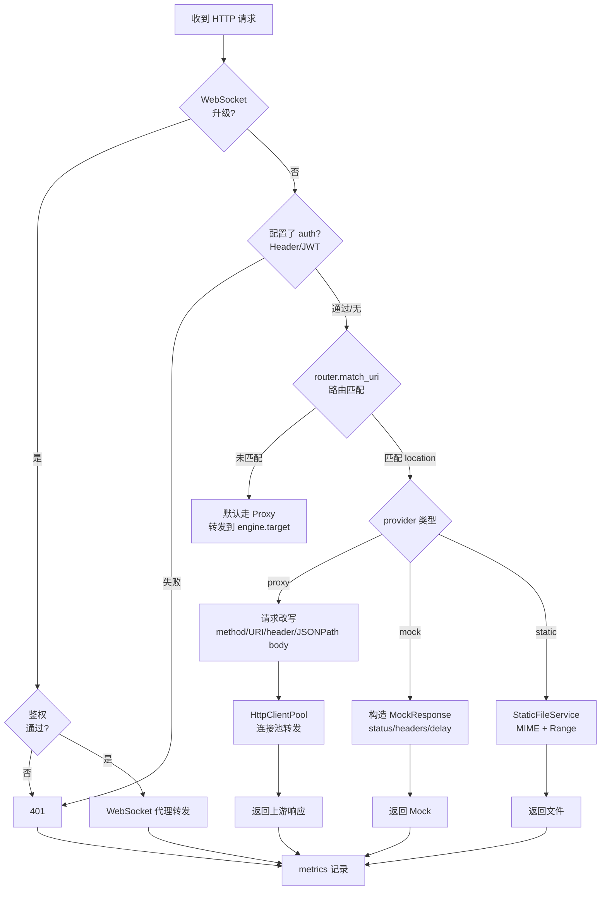
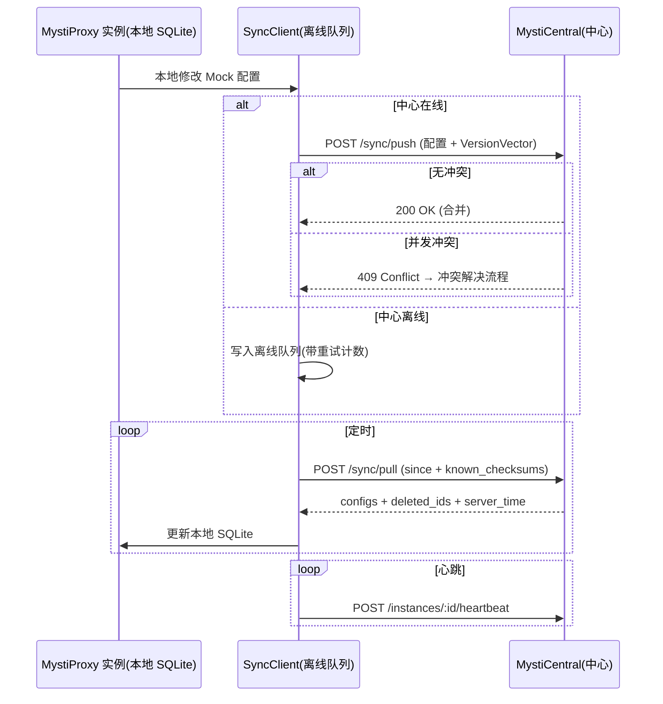

# MystiProxy 项目全景概览

> 本文档基于源码阅读与真实运行验证（2026-08-14），所有结论均有源码位置或运行观测支撑。
> 验证方式：真实二进制 + 真实上游服务 + 临时 PostgreSQL 容器实测。

## 一、项目定位

MystiProxy 是一套 **"灵活代理 + Mock 测试 + 中心化管理"** 的完整生态系统，由 Rust Workspace（3 个 crate，约 2 万行）+ React 前端 + 容器化部署组成。

| 组件 | 技术栈 | 职责 |
|------|--------|------|
| `mystiproxy/` | tokio + hyper | 代理服务器本体：TCP/HTTP/Forward 三类引擎、Mock、静态文件、鉴权、TLS |
| `mysticentral/` | axum + PostgreSQL + JWT | 中心管理端：Mock 配置集中管理、多实例同步、冲突解决、分析统计 |
| `mysti-common/` | serde | 共享数据模型（VersionVector 向量时钟、MockConfiguration 等） |
| `frontend/` | React 19 + AntD 6 + ECharts | 管理控制台 Web UI（Dashboard/Mocks/环境/实例/分析/冲突/用户） |
| `chart/` `container/` | Helm / Docker | K8s 与容器化部署（含 HPA/Ingress/RBAC） |

## 二、总体架构图



## 三、HTTP 请求处理流程



## 四、功能全景

- **代理能力**
  - TCP 4 层转发：`tcp://` 与 `unix://` 互转、连接/请求双超时、双向流量统计（UDP 尚未实现，地址解析层即拒绝）
  - HTTP 7 层代理：method/URI 改写、Header 增删改（overwrite/missed/forceDelete）、JSONPath 请求体转换（overwrite/add/delete）、Host 头智能重写
  - Forward 正向代理：CONNECT 隧道、上游代理链式转发、Basic 认证、主机黑白名单
- **Mock 与内容服务**
  - Mock 响应：状态码/响应头/延迟模拟
  - 静态文件：MIME 自动识别、Range 断点续传、目录列表
- **安全**：Header/JWT 鉴权、NTLM 认证、TLS 单向/双向（mTLS）
- **路由**：Full / Prefix / Regex / PrefixRegex 四种匹配模式
- **中心化管理（mysticentral）**：Mock CRUD、多环境管理、实例注册与心跳（`endpoint_url` 必填）、版本向量冲突检测、导入导出、分析统计、JWT 用户管理
- **本地管理（management，feature 门控）**：SQLite 离线存储、离线操作队列、重试策略、与中心双向同步
- **运维**：多引擎并存、Docker 镜像、Helm Chart（HPA/Ingress/RBAC）

## 五、分布式同步机制



核心设计：`VersionVector` 向量时钟做因果版本追踪（`dominates`/`merge`），内容哈希（SHA-256）实现增量同步与冲突检测，支持完全离线的代理节点（Local-First 架构）。

## 六、运行验证记录（2026-08-14）

### mystiproxy（真实二进制 + Python 上游实测）

| 验证路径 | 请求 | 观测结果 |
|---------|------|---------|
| Mock 路由（Full 匹配） | `GET :18080/mock/hello` | HTTP 200，`content-type=application/json` |
| 代理路由（Prefix 匹配） | `GET :18080/api/v1/` | 上游 access log 确认到达，连接池日志出现 |
| 默认路由（无匹配转发） | `GET :18080/anything/else` | 上游 access log 确认到达 |
| TCP 引擎（CLI 模式） | `curl :18082/` | HTTP 200 穿透到上游 |

### mysticentral（真实二进制 + PostgreSQL 16 容器实测）

- `/health`、环境 CRUD、Mock CRUD、实例注册（`endpoint_url` 必填）、心跳、`sync/pull`（正确返回新建 mock）、`sync/push`（含冲突检测与解决，见下）、分析统计、导出、冲突列表全部正常
- 数据库迁移自动执行成功
- **冲突路径实测**：push 一个与中心版本向量并发（`is_concurrent_with`）的本地修改 → 返回 `{"conflicts":[{reason:"concurrent_modification", local, central}]}`，中心版本未被覆盖；随后 `POST /sync/conflicts/:id/resolve`（strategy=keep_local）→ 本地版本胜出，合并后的版本向量包含两侧分量；push 一个被中心支配（dominated）的旧版本 → 正常 `accepted`，无误报冲突。向量时钟语义（并发检测、支配判定、合并递增）全部按设计工作。

### 前端 ↔ 中心端接口对齐情况（实测，2026-08-14）

前端（`frontend/src/api/*.ts`）调用的部分端点在 mysticentral 中**尚未实现**，登录后相关页面将不可用：

| 前端调用 | 实测响应 | 说明 |
|---------|---------|------|
| `POST /auth/login`、`POST /auth/logout` | 404 | 登录功能后端缺失（前端有完整登录页与 token 存储逻辑） |
| `GET/PUT /users`、`/users/me`、`/users/me/password` | 404 | 用户管理后端缺失 |
| `GET/PUT /settings` | 404 | 设置页后端缺失 |
| `GET /sync/status` | 404 | 同步状态页后端缺失 |
| `GET/PUT/DELETE /conflicts/*` | 404 | 前端使用 `/conflicts`，后端实际为 `/sync/conflicts`，**路径不一致** |
| `POST /instances/:id/push` | 404 | 推送单实例配置后端缺失 |
| `POST /instances/push-all` | 405 | 路由存在但方法不匹配 |
| `GET/POST /mocks`、`/environments`、`/instances`、`/sync/pull` | 200 | 正常对齐 |

> 结论：前端是按**目标 API 设计**先行开发的，mysticentral 尚未实现 auth/users/settings/conflicts 等模块。集成时需补齐后端或将前端指向已实现的端点。

### 工程验证

- `cargo test --all`：21 通过 / 0 失败 / 1 忽略
- 前端 `tsc -b && vite build`：构建成功产出 `dist/`

## 七、成熟度说明（重要）

以下为实测确认的现状，注意与旧文档的差异：

1. **metrics 端点未实现**：`GET :9090/metrics` 无响应。`metrics.rs` 的 `start_server()` 仅打日志，Prometheus 导出实际未实现（指标在进程内计数但无 HTTP 暴露）。
2. **连接池已接入主流程**：`doc/features.md` 中"连接池尚未启用"的说法已过时，运行日志证实 `HttpClientPool` 已被调用。
3. **鉴权已接入主流程**：`doc/features.md` 中"认证逻辑未接入 HTTP Handler"的说法已过时，`handler.rs` 中 `authenticator.authenticate()` 已在请求链路中调用。
4. **实例注册 `endpoint_url` 为必填字段**，API 会返回明确错误提示。

## 八、快速上手

```bash
# 代理 + Mock 混合配置示例
./target/debug/mystiproxy --config config.yaml

# 纯 TCP 转发
./target/debug/mystiproxy --listen tcp://0.0.0.0:8080 --target tcp://10.0.0.1:80

# 中心管理端（需 PostgreSQL）
MYSTICENTRAL_DATABASE_URL=postgres://... \
MYSTICENTRAL_JWT_SECRET=<32+字符> \
./target/debug/mysticentral --addr 0.0.0.0:8090

# 前端
cd frontend && npm run build
```


## 九、mysticentral 与本地管理 API 接口清单（实测汇总）

### mysticentral 已实现（全部实测 200）

| 方法 | 路径 | 功能 |
|------|------|------|
| GET | `/health` | 健康检查 |
| GET/POST | `/api/v1/mocks` | Mock 列表/创建 |
| GET/PUT/DELETE | `/api/v1/mocks/:id` | Mock 详情/更新/删除 |
| POST | `/api/v1/mocks/import` | 批量导入 |
| GET | `/api/v1/mocks/export` | 导出 |
| GET/POST | `/api/v1/environments` | 环境列表/创建 |
| GET/PUT/DELETE | `/api/v1/environments/:id` | 环境 CRUD |
| GET/POST | `/api/v1/instances` | 实例列表/注册（`endpoint_url` 必填） |
| GET/DELETE | `/api/v1/instances/:id` | 实例详情/删除 |
| POST | `/api/v1/instances/:id/heartbeat` | 心跳 |
| POST | `/api/v1/sync/pull` | 拉取变更 |
| POST | `/api/v1/sync/push` | 推送变更（含向量时钟冲突检测） |
| GET | `/api/v1/sync/conflicts` | 冲突列表（当前返回空，冲突仅在 push 响应中体现） |
| POST | `/api/v1/sync/conflicts/:id/resolve` | 冲突解决（keep_local/keep_central/merge） |
| GET | `/api/v1/analytics/stats` | 全局统计 |
| GET | `/api/v1/analytics/mock/:id` | 单 Mock 统计 |

### mysticentral 未实现（前端已调用，实测 404/405）

| 前端调用 | 状态 |
|---------|------|
| `POST /api/v1/auth/login`、`/auth/logout` | 404（AuthService 已有 JWT 签发能力但未挂路由） |
| `GET/POST /api/v1/users`、`/users/me`、`/users/me/password` | 404 |
| `GET/PUT /api/v1/settings` | 404 |
| `GET /api/v1/sync/status` | 404（本地管理 API 有同名端点，但中心端没有） |
| `GET/PUT/DELETE /api/v1/conflicts/*` | 404（路径不一致，后端为 `/sync/conflicts`） |
| `POST /api/v1/instances/:id/push` | 404 |
| `POST /api/v1/instances/push-all` | 405（GET 已注册，POST 未注册） |

### mystiproxy 本地管理 API（`local-management` feature，2026-08-14 修复编译后可用）

| 方法 | 路径 | 功能 |
|------|------|------|
| GET | `/api/v1/health` | 健康检查 |
| GET/POST | `/api/v1/mocks` | 本地 Mock 列表/创建（SQLite） |
| GET/PUT/DELETE | `/api/v1/mocks/:id` | 本地 Mock CRUD |
| POST/PUT/DELETE | `/api/v1/mocks/batch` | 批量操作 |
| GET | `/api/v1/sync/status` | 同步状态 |
| POST | `/api/v1/sync/trigger` | 手动触发同步 |

> 注：该模块此前因类型重导出缺失和泛型括号错误无法编译（`cargo build --features local-management` 失败），已修复（commit 849333c），157 单元测试 + 11 文档测试全部通过。
