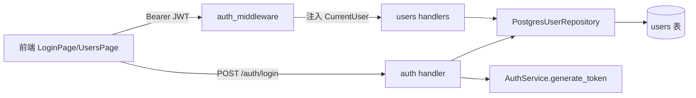

# F1 用户认证与用户管理 — Design

## 总体设计

在 `mysticentral` 中新增 `user_repository.rs` 与 `handlers/auth.rs`、`handlers/users.rs`，复用既有 `AuthService`（JWT + Argon2）与已迁移的 `users` 表。



## 代码设计

### 1. PostgresUserRepository（新增 `services/user_repository.rs`）

```rust
#[async_trait]
pub trait UserRepository: Send + Sync {
    async fn create(&self, user: User) -> ApiResult<User>;
    async fn find_by_id(&self, id: Uuid) -> ApiResult<Option<User>>;
    async fn find_by_username(&self, username: &str) -> ApiResult<Option<User>>;
    async fn find_all(&self) -> ApiResult<Vec<User>>;
    async fn update(&self, user: User) -> ApiResult<User>;
    async fn delete(&self, id: Uuid) -> ApiResult<()>;
    async fn update_password(&self, id: Uuid, hash: &str) -> ApiResult<()>;
    async fn update_last_login(&self, id: Uuid) -> ApiResult<()>;
    async fn count(&self) -> ApiResult<i64>;
}

pub struct PostgresUserRepository { pool: PgPool }
```

实现要点：
- SQL 与现有 `postgres_repository.rs` 风格一致（sqlx query_as）
- `last_login_at` 列在初始 schema 中**不存在**，需新迁移 `20260814000000_user_last_login.sql` 增加 `ALTER TABLE users ADD COLUMN last_login_at TIMESTAMPTZ`
- User 模型需加 `last_login_at: Option<DateTime<Utc>>`（serde skip，与前端 `last_login_at?: string` 对齐）

### 2. Bootstrap 首管理员（`services/bootstrap.rs`）

启动时若 `count() == 0`，从环境变量读取初始管理员：
- `MYSTICENTRAL_ADMIN_USERNAME`（默认 `admin`）
- `MYSTICENTRAL_ADMIN_PASSWORD`（默认 `changeme123`，日志警告强制修改）
- Argon2 哈希后写入，role=admin

这是 PostgreSQL `POSTGRES_PASSWORD` 的通行模式，解决"第一个用户从哪来"的引导问题。

### 3. Auth handlers（`handlers/auth.rs`）

```
POST /api/v1/auth/login   {username, password} -> {token, user, expires_at}
POST /api/v1/auth/logout  -> 204（JWT 无状态，客户端删除 token 即可，端点保留用于审计兼容）
```

login 流程：find_by_username → verify_password(Argon2) → update_last_login → generate_token。
失败统一返回 401 `invalid username or password`（不区分用户不存在/密码错误，防枚举）。

### 4. Users handlers（`handlers/users.rs`，全部受 JWT 保护）

```
GET    /api/v1/users            admin/editor 可列表
POST   /api/v1/users            admin 创建（Argon2 哈希密码）
GET    /api/v1/users/me         任意角色查自己
PUT    /api/v1/users/me/password 修改自己密码（验证旧密码）
GET    /api/v1/users/:id        admin/editor
PUT    /api/v1/users/:id        admin（改角色/邮箱，不能改自己角色防锁死）
DELETE /api/v1/users/:id        admin（不能删自己）
```

### 5. 鉴权中间件（接线既有 `middleware/auth.rs`）

axum middleware：从 `Authorization: Bearer <token>` 提取 → `validate_token` → 查库确认用户仍存在 → 将 `CurrentUser` 写入 request extensions。无/坏 token 返回 401。路由层用 `RequireRole` 提取器做 admin 校验，非 admin 返回 403。

### 6. 路由组装（routes.rs）

```rust
let protected = Router::new()
    .route("/api/v1/users", get(list_users).post(create_user))
    ...route_layer(middleware::from_fn_with_state(state.clone(), auth_middleware)));

Router::new()
    .merge(create_routes())        // 既有公开路由
    .route("/api/v1/auth/login", post(login))
    .merge(protected)
```

## 前端契约对齐（实测来源）

| 前端类型 | 后端对应 | 对齐点 |
|---------|---------|--------|
| `User.role: 'admin'\|'user'\|'viewer'` | `UserRole::Admin/Editor/Viewer` | ⚠️ 前端写 `user` 后端是 `editor`，serde 用 rename_all=lowercase 输出 `editor`，前端 antd 渲染非枚举值也能显示，**不改后端枚举**（editor 更符合 RBAC 语义），前端 types 不受影响（TS 结构类型宽容） |
| `LoginResponse{token,user,expires_at}` | 既有 `LoginResponse` | ✅ 完全一致 |
| `last_login_at?: string` | 新增列+字段 | ✅ serde Option 序列化为 null/缺省 |
| `ChangePasswordRequest{old_password,new_password}` | 新 handler DTO | ✅ |

## 错误处理

复用 `ApiError`：401（未认证/凭据错误）、403（角色不足）、404（用户不存在）、409（用户名/邮箱重复）。

## 测试设计（TDD 顺序）

1. **先写仓储测试**（sqlx `test` feature + 临时库）：create/find_by_username/update_password 唯一约束冲突
2. **auth_service 密码往返测试**：hash → verify 成功；错密码失败；token 签发→验证过期
3. **handlers 集成测试**（axum tower::ServiceExt + 内存状态）：登录成功/401、无 token 访问 users 401、admin 创建用户、改密码后旧密码失效
4. **bootstrap 测试**：空库创建 admin、非空库不创建

覆盖率目标：新增代码 ≥70%（仓储分支 + handler 分支全覆盖，JWT 过期分支用短 exp 测）。
