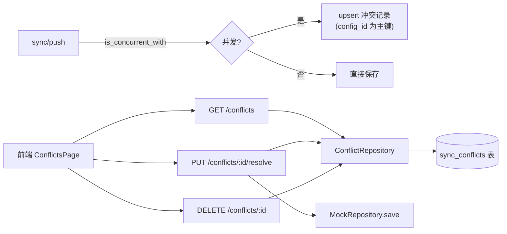

# F2 冲突管理 API 对齐 — Design

## 总体设计

新增 `sync_conflicts` 持久化表 + `ConflictRepository`，`sync/push` 检测到并发修改时登记，前端 4 端点读写该表。解决逻辑复用既有 `resolve_conflict` 的三策略实现。



## 代码设计

### 1. 迁移 `20260815000000_sync_conflicts.sql`

```sql
CREATE TABLE IF NOT EXISTS sync_conflicts (
    config_id UUID PRIMARY KEY,          -- 一个配置同时最多一条冲突
    local_version JSONB NOT NULL,        -- 实例推上来的版本
    central_version JSONB NOT NULL,      -- 中心当前版本
    detected_at TIMESTAMPTZ NOT NULL DEFAULT NOW()
);
```

主键选 `config_id` 而非自增 id：同一配置的重复冲突**覆盖更新**（upsert），避免列表被同一配置的重复冲突淹没，且前端按 config_id 寻址天然匹配。

### 2. `services/conflict_repository.rs`

```rust
#[derive(sqlx::FromRow)]
struct ConflictRow {
    config_id: Uuid,
    local_version: serde_json::Value,
    central_version: serde_json::Value,
    detected_at: DateTime<Utc>,
}

#[async_trait]
pub trait ConflictRepository: Send + Sync {
    async fn upsert(&self, c: ConflictRecord) -> ApiResult<()>;
    async fn find_by_config(&self, config_id: Uuid) -> ApiResult<Option<ConflictRecord>>;
    async fn find_all(&self) -> ApiResult<Vec<ConflictRecord>>;
    async fn delete(&self, config_id: Uuid) -> ApiResult<bool>;
}

pub struct PostgresConflictRepository { pool: PgPool }
```

`ConflictRecord` 领域结构体：`{config_id, local_version: MockConfiguration, central_version: MockConfiguration, detected_at}`，row↔record 转换时 serde_json 反序列化。

### 3. `sync/push` 登记冲突（修改 routes.rs::sync_push）

```rust
// 现有分支：
if existing.version_vector.is_concurrent_with(&config.version_vector) {
    // 新增：持久化登记（替换原仅塞进响应的逻辑）
    conflict_repo.upsert(ConflictRecord {
        config_id: config.id,
        local_version: config.clone(),
        central_version: existing.clone(),
        detected_at: Utc::now(),
    }).await.ok();  // 登记失败不阻塞 push 响应
    conflicts.push(json!({...}));  // 响应结构保持向后兼容
}
```

### 4. `handlers/conflicts.rs`（4 端点，JWT 保护）

```
GET    /api/v1/conflicts            -> {"data": [...], "total": N}
GET    /api/v1/conflicts/:configId  -> ConflictResponse 或 404
PUT    /api/v1/conflicts/:configId/resolve
DELETE /api/v1/conflicts/:configId  -> 204
```

**resolve 处理**（适配前端 `resolution` 字段 + PUT 方法）：
```rust
match body.resolution {
    "keep_local"  => 保存 local_version，向量 increment(随机)（沿用既有逻辑）
    "keep_central" => 不动配置
    "merge"       => merged_config 必填，校验其 id == config_id 后保存，
                     version_vector = local ⊔ central（双侧合并）再 increment
}
// 三种策略成功后：conflict_repo.delete(config_id)
```

**ignore（DELETE）**：只删冲突记录，配置保持 central 版不动（"保留两版"语义 = 放弃本次推送的 local 版）。

### 5. 路由注册

挂到 `create_protected_routes()`（F1 已建 JWT 层），复用中间件无需新接线。旧端点 `/sync/conflicts`（GET 空）与 `/sync/conflicts/:id/resolve`（POST strategy）保留但内部改为读新表，保持兼容。

### 6. 前端契约映射

| 前端字段 | 后端来源 |
|---------|---------|
| `config_id` | conflict.config_id |
| `local_version: MockConfiguration` | serde 反序列化 local_version JSONB |
| `central_version: MockConfiguration` | 同上 |
| `detected_at: string` | RFC3339 |
| `resolution: 'keep_local'\|...` | 枚举字符串直接 match |
| `merged_config?: MockConfiguration` | Option<Json> |

## 测试设计（TDD）

1. **单元**：ConflictRow↔Record 转换（含坏 JSON 容错）、resolution 枚举解析、响应序列化形状（config_id/local_version/central_version/detected_at 四字段）
2. **集成（真实 PG，续用 F1 的 auth_integration 模式）**：
   - push 并发版本 → `GET /conflicts` 出现该记录（total=1）
   - `GET /conflicts/:id` 详情与 push 时两版一致
   - PUT resolve(keep_local) → 配置变 local、列表清空
   - PUT resolve(merge) 带 merged_config → 保存合并版、向量含双侧分量
   - PUT resolve(merge) 缺 merged_config → 400
   - DELETE → 204、列表空、配置保持 central
   - 重复 push 同一配置冲突 → 仍只有一条（upsert 语义）
3. 覆盖率：conflict_repository + handlers/conflicts ≥70%
