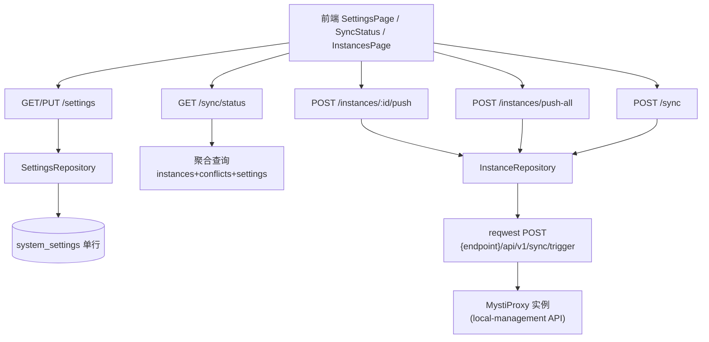

# F3 设置 / 同步状态 / 实例推送 — Design

## 总体设计

三块能力共用一次迁移：`system_settings` 单行表。设置仓储读写该行；同步状态由三张既有表聚合（instances 心跳 + sync_conflicts 计数）；实例推送是中心对实例 `endpoint_url` 的 HTTP 下发。



## 代码设计

### 1. 迁移 `20260816000000_system_settings.sql`

```sql
CREATE TABLE IF NOT EXISTS system_settings (
    id BOOLEAN PRIMARY KEY DEFAULT TRUE CHECK (id),  -- 恒为单行
    central_url TEXT NOT NULL DEFAULT '',
    sync_interval_secs INTEGER NOT NULL DEFAULT 30,
    log_level TEXT NOT NULL DEFAULT 'info',
    max_request_history INTEGER NOT NULL DEFAULT 1000,
    default_environment TEXT,
    updated_at TIMESTAMPTZ NOT NULL DEFAULT NOW()
);
INSERT INTO system_settings (id) VALUES (TRUE) ON CONFLICT DO NOTHING;
```

`id BOOLEAN CHECK(id)` 是 PostgreSQL 单行表的惯用技巧（比 `id=1` 更能表达约束语义）。

### 2. `services/settings_repository.rs`

```rust
pub struct SystemSettings {
    pub central_url: String,
    pub sync_interval: i64,        // 前端 sync_interval（秒）
    pub log_level: String,         // debug|info|warn|error
    pub max_request_history: i64,
    pub default_environment: Option<String>,
}

#[async_trait]
pub trait SettingsRepository: Send + Sync {
    async fn get(&self) -> ApiResult<SystemSettings>;
    async fn update(&self, patch: SettingsPatch) -> ApiResult<SystemSettings>;
}
```

`SettingsPatch` 全 Option 字段，PUT 语义 = 部分更新。校验：`sync_interval ∈ [5, 3600]`、`log_level ∈ 枚举`、`max_request_history ≥ 0`、`central_url` 若非空必须 http(s):// 前缀。

### 3. `handlers/settings.rs`

```
GET /api/v1/settings  -> SystemSettings JSON（前端字段名 camel/snake 对齐：全 snake_case）
PUT /api/v1/settings  -> 校验 → 更新 → 返回新值；非法 400
```

### 4. `handlers/sync_extra.rs`（/sync/status 与 POST /sync）

```
GET /api/v1/sync/status -> {
  connected: bool,            // 存在心跳 90s 内的实例
  last_sync_at: Option<rfc3339>,  // 最近实例 last_sync_at
  sync_in_progress: false,
  pending_changes: i64,       // sync_conflicts 行数（F2 表）
  central_url: String         // settings.central_url
}
POST /api/v1/sync {force?} -> 对全部实例执行推送（同 push-all），
  返回 {success, synced_count, conflicts: 当前冲突列表, synced_at}
```

### 5. 实例推送核心 `services/push_service.rs`

```rust
pub struct PushOutcome { pub instance_id: Uuid, pub ok: bool, pub detail: String }

pub async fn push_to_instance(pool: &PgPool, instance_id: Uuid) -> ApiResult<PushOutcome> {
    // 1. 取实例（不存在 → NotFound）
    // 2. POST {endpoint_url}/api/v1/sync/trigger，3s 超时
    // 3. 2xx → 更新 instances.last_sync_at = now, sync_status='connected', ok=true
    //    非 2xx/连接失败 → sync_status='error', ok=false（不吞错误）
}

pub async fn push_to_all(pool: &PgPool) -> ApiResult<Vec<PushOutcome>> { …并发循环… }
```

handlers：
```
POST /api/v1/instances/:id/push    -> 单实例；失败 502 + detail
POST /api/v1/instances/push-all    -> {results: [{instance_id, ok, detail}], pushed, failed}
```

**路由顺序注意**：`/instances/push-all` 必须注册在 `/instances/:id` 之前，否则 "push-all" 会被当作 `:id` 解析失败。

### 6. 路由挂载

settings/sync/status/push 全部进 `create_protected_routes()`（JWT 保护，admin/editor 可读写，沿用现有 RBAC 门槛——设置变更建议 admin，读取任意登录者）。

## 测试设计（TDD）

1. **单元**：SettingsPatch 校验矩阵（合法/每种非法值）、单行表 row↔struct、PushOutcome JSON 形状
2. **集成（真实 PG + 假实例 HTTP 服务）**：
   - settings GET 默认值 → PUT 修改 → GET 回读一致；PUT 非法 log_level/sync_interval/central_url → 400
   - 注册一个 `endpoint_url` 指向本地 mock HTTP 服务（axum one-shot 起真实 listener）的实例 → push 成功、last_sync_at 更新
   - endpoint 指向无人监听端口 → push 返回 502、sync_status=error
   - /sync/status：无实例 connected=false；有新鲜心跳 true；制造 2 条冲突 → pending_changes=2
   - push-all 两实例一好一坏 → results 汇总正确
3. 覆盖率 ≥70%
