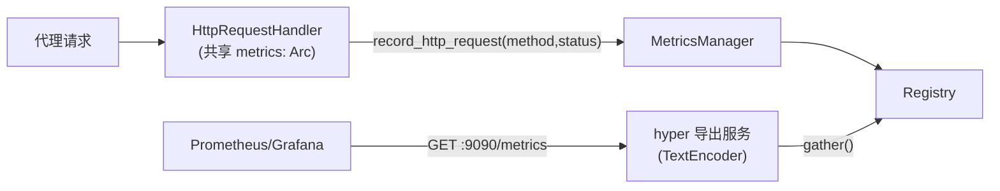

# F4 Prometheus 指标导出 — Design

## 总体设计

补全 Registry 注册 + HTTP 导出 + label 维度 + 进程级单例四件事，全部落在既有 `metrics.rs` 内，不新增文件。



## 代码设计

### 1. metrics.rs 重构

```rust
pub struct MetricsManager {
    registry: Registry,
    http_requests_total: IntCounterVec,       // labels: method, status
    http_request_duration_seconds: Histogram,
    tcp_connection_duration_seconds: Histogram,
    errors_total: IntCounter,
    memory_usage_bytes: Gauge,
}

impl MetricsManager {
    pub fn new() -> Self {
        let registry = Registry::new();
        // 构建每个指标 → registry.register(...).ok()  // 幂等：AlreadyReg 忽略
    }

    /// 产出 exposition 文本（供测试与导出共用）
    pub fn gather(&self) -> String {
        let mut buf = Vec::new();
        TextEncoder::new()
            .encode(&self.registry.gather(), &mut buf)
            .unwrap_or_default();
        String::from_utf8_lossy(&buf).into_owned()
    }

    pub async fn start_server(self: Arc<Self>, addr: SocketAddr) {
        // hyper 1.x 简单服务：GET /metrics → 200 text/plain; gather()
        // 其他路径 404
    }
}
```

要点：
- `record_http_request(method, _path, status, duration)` 改为 `with_label_values(&[method, &status.to_string()]).inc()`；path 保持不用（防高基数）
- `start_server` 接收 `Arc<Self>`（原来 `&mut self` 是错的，服务需要 'static）
- Duration observe 不变

### 2. 导出 HTTP 服务（metrics.rs 内）

```rust
async fn metrics_service(metrics: Arc<MetricsManager>) -> hyper::service::service_fn(...) {
    // GET /metrics → Response::builder()
    //     .header(CONTENT_TYPE, "text/plain; version=0.0.4")
    //     .body(Full::new(Bytes::from(metrics.gather())))
}
```

用 hyper 1.x + http_body_util（与 http/server.rs 现有栈一致），监听独立端口（默认 127.0.0.1:9090）。

### 3. main.rs 与 handler.rs 接线

- main：`let metrics = Arc::new(MetricsManager::new()); metrics.start_server(addr).await;`（spawn 到后台）
- handler：`HttpRequestHandler::new` 增加可选注入。为保持 `create_handler(Arc<EngineConfig>)` 公共 API 兼容，新增 `with_metrics(config, metrics)` 构造器；`new` 内部改为使用**全局默认 Registry**：
  - `Registry::default()` 是 prometheus crate 的进程级全局注册表——`MetricsManager::new()` 改用 default registry，main 与 handler 自然聚合到一起，无需显式传引用（最小侵入）
- `record_error` / `record_tcp_connection` 调用点不变

### 4. 测试设计（TDD）

单元（不需要网络）：
1. `gather()` 输出包含 5 个指标名与 `# HELP`/`# TYPE`
2. `record_http_request` 两次不同 method/status → 输出含两行带 label 的 `http_requests_total{method="GET",status="200"} 1`
3. 计数累加：同 label 记 3 次 → 值为 3
4. 重复 `MetricsManager::new()` 不 panic（全局 registry 幂等注册）
5. duration histogram observe 后输出 `_bucket{le=...}` 行
6. `record_memory_usage(1024, 2048)` → `memory_usage_bytes 1024`

集成（真实端口）：
7. `start_server` 后 `GET /metrics` 返回 200、content-type 正确、body 含指标
8. 记录指标后再次抓取值增长
9. `GET /nope` → 404

覆盖率：metrics.rs 新逻辑分支（label 组合、404 路径、编码失败兜底）全覆盖。
