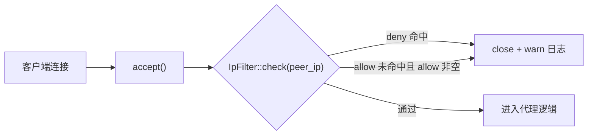

# F5 入站 IP 过滤 — Design

## 总体设计

新增 `mystiproxy/src/ip_filter.rs`：CIDR 解析与匹配核心。`EngineConfig` 增加 `allow`/`deny` 字段，TCP 与 HTTP 引擎 accept 后立即判定。



## 代码设计

### 1. `ip_filter.rs` 核心

```rust
pub struct IpFilter {
    allow: Vec<Cidr>,
    deny:  Vec<Cidr>,
}

struct Cidr { net: IpAddr, prefix: u32 }

impl IpFilter {
    /// None = 不过滤；Some(filter) = 启用
    pub fn from_config(allow: &Option<Vec<String>>, deny: &Option<Vec<String>>)
        -> Result<Option<Self>, MystiProxyError>;

    pub fn is_allowed(&self, peer: IpAddr) -> bool {
        // 1. deny 命中 → false（优先）
        // 2. allow 为空 → true（无白名单即全放行剩余）
        // 3. allow 命中 → true，否则 false
    }
}
```

CIDR 匹配算法：地址族一致（v4 对 v4）时，将 IpAddr 转 128 位 u128，掩码对齐后比较。v4 与 v6 视为不同族不匹配（不隐式映射，避免歧义）。

解析：`"10.0.0.0/8"`、`"::1/128"`、无前缀的 `"1.2.3.4"` 视为 `/32`（v6 为 /128）。

### 2. 配置接入（config/mod.rs）

```rust
pub struct EngineConfig {
    ...
    #[serde(default)]
    pub allow: Option<Vec<String>>,   // CIDR 白名单
    #[serde(default)]
    pub deny:  Option<Vec<String>>,   // CIDR 黑名单（优先）
}
```

默认 None → 行为与现状一致。

### 3. 引擎接入（两处，各 3-5 行）

- `proxy/mod.rs::ProxyServer::run`：accept 得到 `(_, addr)` 后
  `if let Some(f) = &self.ip_filter { if !f.is_allowed(addr.ip()) { warn!(...); continue; } }`
- `http/server.rs` accept 循环同模式

`ProxyServer`/`HttpServer` 构造时 `IpFilter::from_config(...)?`，非法 CIDR → 启动失败（fail-fast）。

## 测试设计（TDD）

单元（ip_filter.rs 内）：
1. CIDR 解析：v4/v6、无前缀单 IP、非法串报错
2. 匹配矩阵：10.0.0.0/8 内外、::1/128、/32 精确、v4 vs v6 不匹配
3. 语义矩阵：deny 命中拒绝；仅 allow 非命中拒绝；两表空放行；deny 优先于 allow
4. from_config：None/None → None；坏 CIDR → Err

集成（真实回环 + 不可路由地址模拟）：
5. 配置 allow=127.0.0.0/8 → 本机 curl 通过（服务正常）
6. allow=10.0.0.0/8（不含 127）→ 本机连接被拒（curl 52/连接重置），日志含拒绝记录
7. 无配置 → 与既有行为一致（回归）

覆盖率：ip_filter.rs 全分支（解析错误路径、两族、三段语义）。
