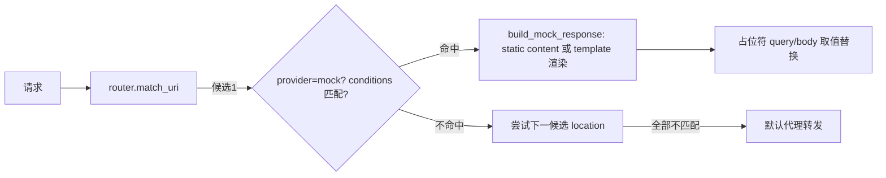

# F6 Mock 条件匹配与模版响应 — Design

## 总体设计

把孤岛引擎接入请求链路，并补齐模版渲染。数据流：



## 代码设计

### 1. 配置扩展（config/mod.rs）

```rust
pub struct ResponseConfig {
    pub status: Option<u16>,
    pub headers: Option<HashMap<String, HeaderAction>>,
    pub body: Option<BodyConfig>,
    pub conditions: Option<Vec<ConditionCfg>>,   // 新增
}

pub struct ConditionCfg {
    pub condition_type: String,   // uri|path|query|header|body|json
    pub value: String,
}

pub struct BodyConfig {
    pub json: Option<JsonBodyConfig>,
    pub body_type: Option<BodyType>,   // static | template（新增 Template）
    pub content: Option<String>,       // static 固定内容
    pub template: Option<String>,      // 模版字符串
}
```

`BodyType` 增加 `Template` 变体（serde lowercase）。

### 2. location 回退匹配（http/handler.rs）

当前 `router.match_uri` 只返回第一个匹配。新增 `Router::match_uri_candidates(uri) -> Vec<(&Route, MatchResult)>`（`match_uri` 保持不变，内部委托第一个候选），handler 中：

- 依序遍历候选
- provider=mock 且 conditions 全命中 → 返回 mock（渲染）
- provider=mock 但条件不命中 → continue 下一个候选
- proxy/static → 沿用第一命中的既有行为（break）
- 全部不命中 → 默认代理

### 3. static content 与模版（改造 build_mock_response）

- `Static` → body = `content`（缺省空串，修复现状恒空体）
- `Template` → `render_template(template, uri, body_json)`

`render_template` 扫描 `{{...}}` 占位符：
- `query.name` → URI query 参数
- `body.$.a.b` / `body.$.list[0].x` → JSON body 轻量 path walker（对象键 / 数组下标），不引依赖
- 未解析的占位符保留原文 + warn 日志

### 4. 条件数据传递

handler 仅当存在 mock+conditions 或 template 的候选时才读取请求 body（保持纯代理路径惰性策略）。

## 测试设计（TDD）

单元：
1. `query.x` 替换 / 缺参数保留原样
2. `body.$.a.b` 嵌套对象 / 数组 `[0]` / 缺路径保留
3. 多占位符混合文本
4. 无占位符原样返回
5. YAML 解析：conditions + template + content 全字段

集成/真实运行：
6. header 条件命中 → mock；不命中 → 回退代理（上游收到请求）
7. query 条件 + template 回显实测
8. static content 返回固定串

覆盖率目标：render 与候选回退分支 ≥70%。
