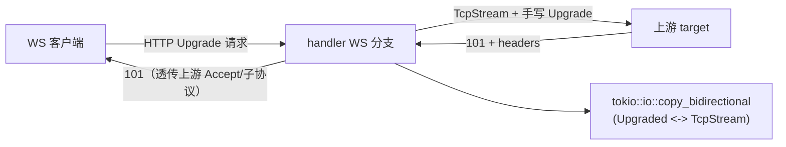

# F8 WebSocket 真正代理 — Design

## 总体设计

客户端与上游两侧都终结为字节流，`copy_bidirectional` 双向透传。协议只发生在握手阶段。



## 代码设计

### websocket.rs 重写核心

```rust
/// 代理 WebSocket 升级：连接上游、转发握手、双向桥接字节流
pub async fn proxy_websocket(
    req: Request<Incoming>,
    target: &str,          // engine.target（tcp://host:port）
) -> Result<Response<Empty<Infallible>>> {
    let key = req.headers().get(SEC_WEBSOCKET_KEY)...;
    let (path_query, origin_headers) = extract_forwardable(&req);

    // 1. 连上游 + 手写握手
    let upstream = match upstream_handshake(target, &path_query, key, origin_headers).await {
        Ok(s) => s,
        Err(e) => return 502_response(),   // 上游拒绝/不可达
    };

    // 2. 客户端 101（Accept 基于客户端 Key；子协议透传上游选择）
    let response = Response::builder()
        .status(101)
        .header(UPGRADE, "websocket")
        .header(CONNECTION, "upgrade")
        .header(SEC_WEBSOCKET_ACCEPT, compute_websocket_accept(key))
        // + 上游 Sec-WebSocket-Protocol（若有）
        .body(Empty::new())?;

    // 3. 拿到升级后的客户端 IO 并桥接
    tokio::spawn(async move {
        match hyper::upgrade::on(req).await {
            Ok(upgraded) => {
                let mut up = TokioIo::new(upgraded);
                let _ = tokio::io::copy_bidirectional(&mut up, &mut upstream_stream).await;
            }
            Err(e) => warn!("websocket upgrade failed: {e}"),
        }
    });

    Ok(response)
}

/// 上游握手：TcpStream 直连，发送标准 GET Upgrade，读取状态行判断 101
async fn upstream_handshake(...) -> Result<TcpStream> {
    // 请求行: GET {path} HTTP/1.1
    // Host: {target_host}
    // Upgrade: websocket / Connection: Upgrade
    // Sec-WebSocket-Key: {key} / Sec-WebSocket-Version: 13
    // (+ 透传 Origin / Sec-WebSocket-Protocol)
    // 读响应首行，101 即成功；其余 Err
}
```

### handler.rs 接线

现有 WS 分支调用处改为：
```rust
let response = crate::http::websocket::proxy_websocket(req, &config.target).await?;
```
保留 `handle_websocket_upgrade` 为弃用兼容（或直接替换，项目内仅一处调用）。

### 关键细节

- **target 解析**：复用 `crate::proxy::address::Address::parse` 拿 SocketAddr（engine.target 已在 TCP 族；unix target 场景 WS 罕见，返回 502 + 日志）
- **Host 重写**：上游握手 Host = target 的 host:port（与 HTTP 代理分支智能 Host 重写一致）
- **上游响应头透传**：`Sec-WebSocket-Protocol`、`Sec-WebSocket-Extensions`（若上游协商了压缩，字节桥无法感知但透传保持客户端协商一致）
- **桥接生命周期**：任一侧 EOF/错误 → 双向关闭（copy_bidirectional 语义天然如此）
- **超时**：沿用 engine request_timeout 包裹握手阶段；桥接阶段不设超时（长连接语义）

## 测试设计（TDD）

单元：
1. `compute_websocket_accept` 回归（现有）
2. 上游握手请求字节串构造（Host/Key/Version 头齐备、hop-by-hop 丢弃）
3. 502 响应形状

集成（真实进程 + Python websockets echo 上游）：
4. 客户端经代理 send/recv echo 帧（`python3 -c` 起客户端，断言往返）
5. 上游连接日志记录握手
6. 上游死端口 → curl 升级请求得 502
7. 普通 GET 经同引擎 → 上游 200（回归）

覆盖率：握手构造/错误分支/头过滤 ≥70%。
