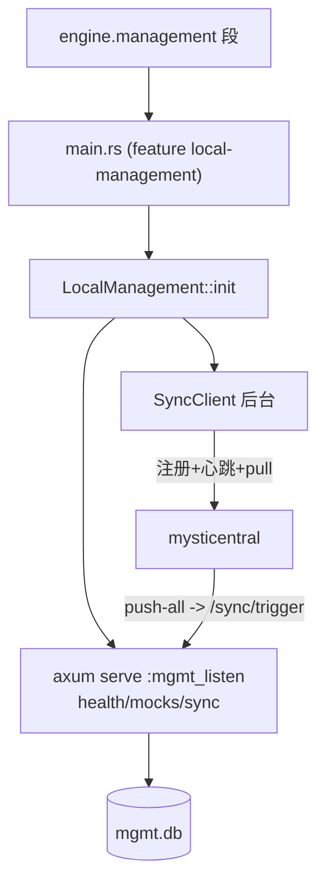

# F9 本地管理 API 启用入口 — Design

## 总体设计

`EngineConfig.management` 段 → main.rs 按 feature 门控启动独立 axum 监听 + 后台同步任务。



## 代码设计

### 1. 配置（config/mod.rs）

```rust
#[derive(Debug, Clone, Serialize, Deserialize, Default)]
pub struct ManagementConfig {
    /// 本地管理 API 监听地址（如 tcp://127.0.0.1:8081）
    pub listen: Option<String>,
    /// SQLite 数据库路径（默认 ./mystiproxy-mgmt.db）
    pub db_path: Option<String>,
    /// 中心地址（如 http://central:8090）；设置后启用同步
    pub central_url: Option<String>,
    /// 同步间隔秒（默认 30）
    pub sync_interval: Option<u64>,
    /// 是否启用（显式 false 关闭；缺 listen 时视为关闭）
    pub enabled: Option<bool>,
}

pub struct EngineConfig {
    ...
    #[serde(default)]
    pub management: Option<ManagementConfig>,
}
```

YAML 形态：
```yaml
mysti:
  engine:
    web:
      listen: tcp://0.0.0.0:8080
      target: tcp://10.0.0.1:80
      proxy_type: http
      management:
        listen: tcp://127.0.0.1:8081
        central_url: http://central:8090
        db_path: /var/lib/mystiproxy/mgmt.db
        sync_interval: 30
```

### 2. main.rs 接线（feature 门控）

```rust
#[cfg(feature = "local-management")]
if let Some(mgmt) = engine_config.management.as_ref().filter(|m| m.is_effective()) {
    use mystiproxy::management::{LocalManagement, LocalManagementBuilder};
    let builder = LocalManagementBuilder::new()
        .enabled(true)
        .db_path(mgmt.db_path.clone().unwrap_or("mystiproxy-mgmt.db"));
    if let Some(url) = &mgmt.central_url {
        builder = builder.with_central(url).sync_interval(mgmt.sync_interval.unwrap_or(30));
    }
    match builder.build().await {
        Ok(lm) => {
            let router = lm.create_router();
            lm.start_sync().await.ok(); // 后台注册/心跳/拉取
            // spawn axum::serve(listener, router)
        }
        Err(e) => error!("引擎 '{}' 管理模块启动失败: {}", name, e),
    }
}
```

`is_effective()`：`enabled != Some(false) && listen.is_some()`。

### 3. ManagementConfig 辅助

```rust
impl ManagementConfig {
    pub fn is_effective(&self) -> bool {
        self.enabled.unwrap_or(true) && self.listen.is_some()
    }
}
```

### 4. 验证规则（F8b 框架追加）

`validate_management`：listen 若存在需 tcp:// 前缀；central_url 若存在需 http(s)://；sync_interval > 0。

## 测试设计（TDD）

单元：
1. `is_effective` 矩阵（无 listen=false / listen+默认=true / enabled=false=false）
2. YAML 解析含 management 段全字段
3. 验证规则（坏 listen scheme / 坏 url / interval 0）

e2e（真实进程 + 真实中心，全链路）：
4. 带配置启动 → `GET :8081/api/v1/health` 200
5. `POST :8081/api/v1/mocks` → SQLite 落盘，重启进程后 mock 仍在
6. 中心 `/api/v1/instances` 出现该实例（sync 注册）
7. 中心 `POST /instances/push-all` → 实例日志出现 sync/trigger 调用记录
8. 无 management 段 → 无额外监听端口（回归）

覆盖率：配置分支 + 接线路径 ≥70%。
